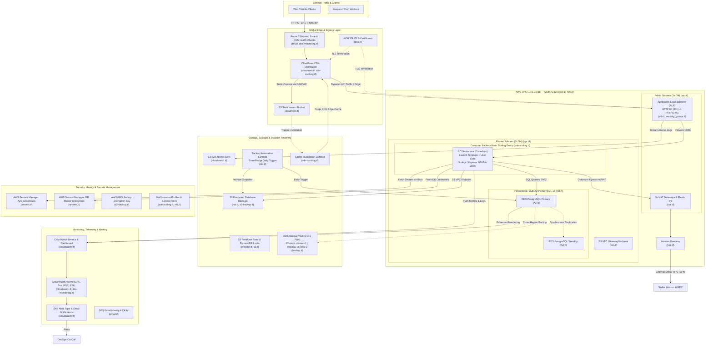

# AWS Infrastructure Overview — Aura Vault Protocol

This document provides a comprehensive, human-readable overview of the AWS cloud infrastructure supporting the **Aura Vault Protocol**, as provisioned and managed by [Terraform](../terraform/).

It details the architectural topology, security controls, networking configuration, compute services, database persistence, edge delivery, secret handling, monitoring systems, and estimated monthly operating costs.

---

## Architecture Diagram

The diagram below illustrates the end-to-end cloud topology across public and private subnets, edge networks, persistence stores, and monitoring layers.

---

## 1. AWS Account Structure & State Management

The Aura Vault Protocol employs isolated environment setups to segregate development, staging, and production workloads. This isolation prevents cross-environment configuration drift, limits blast radiuses, and ensures least-privilege resource access.

### Environment Segregation

| Environment | Purpose | Key Attributes |
|---|---|---|
| **dev** | Integration and developer testing | Single NAT gateway, smaller instance classes, deletion protection disabled |
| **staging** | Pre-production testing and rehearsal | Mirrors production topology, automated test runs, sanitised data |
| **prod** | Production customer-facing traffic | Multi-AZ RDS, 3x NAT Gateways, strict deletion protection, automated cross-region backup replication |

### Terraform Remote State & Locking

Infrastructure state is preserved in an encrypted remote S3 backend with state locking managed by DynamoDB to prevent concurrent executions and state corruption.

- **State S3 Bucket**: `aura-vault-terraform-state` (server-side encryption enabled with AES-256).
- **Locking Table**: `aura-vault-terraform-locks` DynamoDB table configured with `PAY_PER_REQUEST` billing mode and hash key `LockID`.
- **Global Tags**: All provisioned resources are automatically tagged with `Project`, `Environment`, and `ManagedBy = "terraform"`.

### Terraform Source Files
- [provider.tf](../terraform/provider.tf) — Provider requirements, S3 remote backend, AWS region configuration, and default tags.
- [main.tf](../terraform/main.tf) — Entry point orchestration and module root.
- [variables.tf](../terraform/variables.tf) — Parameter definitions for VPC CIDR, availability zones, compute sizing, and credentials.
- [s3.tf](../terraform/s3.tf) — Terraform state locking table and state store declarations.

---

## 2. VPC Layout (Subnets, AZs, NAT Gateway)

The network architecture is built around a dedicated Virtual Private Cloud (VPC) adhering to AWS Well-Architected security best practices.

### CIDR & Subnet Distribution

The default network allocation uses the `10.0.0.0/16` CIDR block, distributed across three Availability Zones (`us-east-1a`, `us-east-1b`, and `us-east-1c`):

| Subnet Type | AZ | CIDR Range | Routing & Gateway | Typical Workloads |
|---|---|---|---|---|
| **Public Subnet 0** | `us-east-1a` | `10.0.0.0/24` | Internet Gateway (`0.0.0.0/0`) | ALB, NAT Gateway 0 |
| **Public Subnet 1** | `us-east-1b` | `10.0.1.0/24` | Internet Gateway (`0.0.0.0/0`) | ALB, NAT Gateway 1 |
| **Public Subnet 2** | `us-east-1c` | `10.0.2.0/24` | Internet Gateway (`0.0.0.0/0`) | ALB, NAT Gateway 2 |
| **Private Subnet 0** | `us-east-1a` | `10.0.3.0/24` | NAT Gateway 0 via Private RT 0 | Backend ASG instances, RDS Primary |
| **Private Subnet 1** | `us-east-1b` | `10.0.4.0/24` | NAT Gateway 1 via Private RT 1 | Backend ASG instances, RDS Standby |
| **Private Subnet 2** | `us-east-1c` | `10.0.5.0/24` | NAT Gateway 2 via Private RT 2 | Backend ASG instances, RDS Subnet Group |

### Ingress & Egress Routing

1. **Internet Gateway (`aws_internet_gateway.main`)**: Provides ingress and egress for public-facing resources located in public subnets.
2. **NAT Gateways (`aws_nat_gateway.main`)**: High-availability egress architecture with a dedicated NAT Gateway and Elastic IP (`aws_eip.nat`) provisioned in each public subnet. Backend servers in private subnets route outbound traffic (e.g. communicating with Stellar Horizon RPC nodes or third-party APIs) through their local AZ's NAT Gateway.
3. **S3 VPC Gateway Endpoint (`aws_vpc_endpoint.s3`)**: Configured directly in the VPC and associated with all private route tables. This routes private subnet traffic destined for Amazon S3 over the internal AWS network backbone, bypassing the NAT Gateways entirely. This drastically reduces data-transfer costs and boosts backup upload performance.

### Security Group Ingress / Egress Matrix

| Security Group | Ingress Rules | Egress Rules | Description |
|---|---|---|---|
| **ALB (`aws_security_group.alb`)** | Port 80 & 443 from `0.0.0.0/0` | Port 3000 to Backend SG; All outbound allowed | Terminate public HTTPS traffic and forward to backend |
| **Backend (`aws_security_group.backend`)** | Port 3000 from ALB SG; SSH Port 22 from bastion/VPC | Port 5432 to RDS SG; Port 443 outbound (HTTPS via NAT) | Enforces zero direct public ingress to API servers |
| **RDS (`aws_security_group.rds`)** | Port 5432 strictly from Backend SG | None required | Completely isolated relational database layer |

### Terraform Source Files
- [vpc.tf](../terraform/vpc.tf) — VPC, subnets, internet gateways, NAT gateways, route tables, and S3 VPC gateway endpoint.
- [security_groups.tf](../terraform/security_groups.tf) — Security group ingress and egress filtering rules.

---

## 3. Compute (EC2 / ECS / EKS)

The primary compute tier runs the Node.js / Express API application inside an elastic Auto Scaling Group (ASG) deployed across private subnets.

### Launch Template & Instances

- **Launch Template (`aws_launch_template.backend`)**: Specifies the Amazon Linux 2 AMI, configurable instance type (default: `t3.medium`), IAM instance profile, and detailed CloudWatch monitoring.
- **Bootstrapping (`user-data.sh`)**: The instance user-data script dynamically injects environment variables, fetches database configuration and application secrets from AWS Secrets Manager, and starts the systemd service running the backend API.
- **IAM Instance Profile (`aws_iam_instance_profile.backend`)**: Grants backend instances least-privilege IAM permissions to read application secrets and write logs to CloudWatch without storing static AWS API keys on disk.

### Auto Scaling Group (ASG)

- **Resource (`aws_autoscaling_group.backend`)**:
  - Minimum capacity: `var.asg_min_size` (default: 2)
  - Desired capacity: `var.asg_desired_capacity` (default: 2)
  - Maximum capacity: `var.asg_max_size` (default: 6)
  - Subnet Distribution: Spans all private subnets across 3 Availability Zones.
  - Health Checks: Configured with `health_check_type = "ELB"` and a 300-second grace period. If an instance fails the ALB target group health check, it is automatically terminated and replaced.
  - Lifecycle: `create_before_destroy = true` ensures zero-downtime rolling replacements.

### Application Load Balancer (ALB)

- **Load Balancer (`aws_lb.main`)**: Internet-facing Application Load Balancer deployed across the three public subnets.
- **Listeners**:
  - Port 80 (HTTP): Automatically issues a `301 Redirect` to HTTPS on port 443.
  - Port 443 (HTTPS): Terminates TLS using an AWS Certificate Manager (ACM) SSL certificate and forwards requests to the backend target group.
- **Target Group (`aws_lb_target_group.backend`)**:
  - Protocol & Port: HTTP on port 3000.
  - Health Check Endpoint: `GET /api/health` with 30-second interval, 2 healthy thresholds, 3 unhealthy thresholds, expecting HTTP 200.
- **Access Logging**: All incoming HTTP/HTTPS access logs are piped directly into an encrypted S3 bucket (`aws_s3_bucket.alb_logs`).

### Kubernetes (EKS) Readiness

The Terraform configuration includes variable support for `var.eks_oidc_issuer_url`. This enables IAM Roles for Service Accounts (IRSA) when migrating backend microservices or indexing workers to Amazon Elastic Kubernetes Service (EKS).

### Terraform Source Files
- [autoscaling.tf](../terraform/autoscaling.tf) — Launch template, ASG configuration, capacity scaling, and user-data templating.
- [alb.tf](../terraform/alb.tf) — Application Load Balancer, HTTP/HTTPS listeners, and health-checked target groups.
- [security_groups.tf](../terraform/security_groups.tf) — Load balancer and compute instance network isolation firewalls.

---

## 4. Database (RDS, Read Replica, Backup)

Persistence is handled by a managed Amazon Relational Database Service (RDS) PostgreSQL instance engineered for high availability, ACID compliance, and disaster recovery.

### Relational Database Service (RDS)

- **Engine & Version**: PostgreSQL 15.4.
- **Instance Sizing**: Configurable via `var.db_instance_class` (default: `db.t3.medium`).
- **High Availability (Multi-AZ)**: `multi_az = true` maintains a synchronous standby replica in a second Availability Zone. If the primary AZ suffers an outage, AWS performs an automatic zero-downtime DNS failover.
- **Storage**: Amazon EBS General Purpose SSD (`gp3`) with storage encryption enabled at rest via AWS managed keys. Automatic storage autoscaling dynamically expands storage from `allocated_storage` (20 GB) up to `max_allocated_storage` (40 GB+).
- **Network Isolation**: Deployed into an isolated `aws_db_subnet_group.main` restricted to private subnets with `publicly_accessible = false`.

### Performance & Configuration Tuning

- **Parameter Group (`aws_db_parameter_group.main`)**: Custom `postgres15` parameters optimize memory and connection limits for API workloads:
  - `max_connections = 100`
  - `shared_buffers = 256MB`
  - `effective_cache_size = 1GB`
- **Telemetry & Insights**:
  - `performance_insights_enabled = true` with 7-day retention.
  - Enhanced Monitoring active at 60-second intervals via a dedicated IAM role (`aws_iam_role.rds_monitoring`) pushing operating system metrics to CloudWatch Logs.

### Backup Strategy & Disaster Recovery (3-2-1 Compliance)

Aura Vault implements a multi-layered backup strategy conforming to the 3-2-1 backup principle:

1. **RDS Automated Snapshots**: Point-in-time recovery (PITR) with a 7-day retention period and daily automated backup window (`03:00 - 04:00 UTC`).
2. **Automated S3 Export via Lambda (`aws_lambda_function.db_backup`)**:
   - An EventBridge scheduled rule (`aws_cloudwatch_event_rule.daily_backup`) fires daily at `03:00 UTC`.
   - Invokes a Python 3.11 Lambda function that captures consistent database snapshots and archives backups to a secure, dedicated S3 bucket (`aws_s3_bucket.backups`).
   - The S3 bucket enforces AES-256 server-side encryption, versioning, and lifecycle expiration:
     - 30 days: Transition to `STANDARD_IA`
     - 60 days: Transition to `GLACIER`
     - 90 days: Automatic expiration
3. **AWS Backup Centralized 3-2-1 Policy (`aws_backup_plan.rds`)**:
   - Primary Backup Vault: `aws_backup_vault.primary` in `us-east-1`.
   - Cross-Region Secondary Vault: `aws_backup_vault.replica` in `us-west-2` (`aws.replica` provider).
   - Rules:
     - **Daily**: Runs at `02:00 UTC`, 7-day retention, copied to `us-west-2` secondary vault.
     - **Weekly**: Runs on Sundays at `03:00 UTC`, 30-day retention.
     - **Monthly**: Runs on the 1st of every month at `04:00 UTC`, 365-day cold retention.
4. **Dedicated KMS Customer Managed Key**: S3 database backups utilize a customer-managed key (`aws_kms_key.backup`) with automatic 30-day key rotation.

### Terraform Source Files
- [rds.tf](../terraform/rds.tf) — RDS PostgreSQL instance, parameter group, subnet group, backup bucket, enhanced monitoring role, and backup Lambda.
- [backup.tf](../terraform/backup.tf) — Centralized AWS Backup vaults, cross-region replication plan, and lifecycle retention schedules.
- [s3-backup.tf](../terraform/s3-backup.tf) — Dedicated PostgreSQL S3 backup bucket, KMS encryption key, and IAM access policies.

---

## 5. CDN (CloudFront, S3)

The front-end web application and static assets are distributed globally via Amazon CloudFront and Amazon S3.

### CloudFront Distribution (`aws_cloudfront_distribution.main`)

- **Global Edge Network**: Distributes cached frontend bundles, images, and static resources globally with ultra-low latency.
- **TLS Configuration**: Enforces TLSv1.2_2021 as minimum protocol version with SNI.
- **Origins**:
  1. **S3 Static Assets Origin**: Backed by `aws_s3_bucket.static_assets`.
  2. **ALB Dynamic Origin**: Routes dynamic API calls directly to the Application Load Balancer.

### Storage & Security Headers

- **Origin Access Control / Identity**: The S3 static assets bucket blocks all public ACLs and bucket policies. Access is strictly granted to CloudFront's service principal via `aws_s3_bucket_policy.static_assets`, preventing users from bypassing the CDN.
- **Response Headers Policy (`aws_cloudfront_response_headers_policy.static_assets`)**:
  - `Strict-Transport-Security`: `max-age=31536000; includeSubdomains; preload` (enforces HSTS for 2 years).
  - `X-Content-Type-Options`: `nosniff`.
  - `X-Frame-Options`: `DENY` (clickjacking defense).
  - `Cache-Control`: `public, max-age=31536000, immutable` for versioned static artifacts.
- **Cache Invalidation Automation**: A Node.js Lambda (`aws_lambda_function.cache_invalidation`) automatically invalidates stale CloudFront paths whenever new frontend releases are uploaded to S3.

### Terraform Source Files
- [cloudfront.tf](../terraform/cloudfront.tf) — CloudFront distribution, S3 static assets bucket, and Origin Access Identity policies.
- [cdn-caching.tf](../terraform/cdn-caching.tf) — Response headers security policy and cache invalidation Lambda function.
- [s3.tf](../terraform/s3.tf) — General S3 configuration standards.

---

## 6. Secrets Management

Security credentials and sensitive configuration items are managed via AWS Secrets Manager and encrypted with AWS Key Management Service (KMS).

### Secrets Architecture

1. **Application Secrets (`aws_secretsmanager_secret.app`)**:
   - Secret Name: `${project_name}/${environment}/app`
   - Stores runtime credentials including:
     - `SENDGRID_API_KEY` / `MAILGUN_API_KEY`: Outbound email notification credentials.
     - `JWT_SECRET`: Signing key for user authentication tokens.
     - `UNSUBSCRIBE_SECRET`: Token validation for email digest unsubscriptions.
     - `WEBHOOK_SIGNING_KEYS`: HMAC keys for verifying external inbound webhook triggers.
   - Seeded out-of-band via AWS CLI (`aws secretsmanager put-secret-value`) so plaintext secrets are never written into Terraform state files.
2. **Database Master Credentials (`aws_secretsmanager_secret.db_master`)**:
   - Secret Name: `${project_name}/${environment}/database/master`
   - Automatically generates a 32-character high-entropy password (`random_password.db_master`) excluding incompatible URI characters.
   - Injected into backend instances via the user-data bootstrap script using IAM role-based authentication.
3. **Secret Rotation**:
   - Configured with `aws_secretsmanager_secret_rotation.app` to automatically trigger a 30-day credential rotation via a dedicated rotation Lambda function.
4. **Disaster Recovery Encryption Key**:
   - Customer-managed KMS key (`aws_kms_key.backup`) with annual automatic key rotation for all encrypted database backups.

### Terraform Source Files
- [secrets.tf](../terraform/secrets.tf) — Application credentials, database secrets, random password generators, and rotation schedules.
- [s3-backup.tf](../terraform/s3-backup.tf) — KMS encryption key and alias for backup data.

---

## 7. Monitoring & Observability (CloudWatch)

Protocol operations and system telemetry are continuously monitored using Amazon CloudWatch, Route 53 health checks, and Amazon SNS.

### CloudWatch Dashboard (`aws_cloudwatch_dashboard.main`)

A unified dashboard provides single-pane-of-glass observability across:
- **EC2 Compute**: Average CPU utilization, NetworkIn, NetworkOut across the Auto Scaling Group.
- **Application Load Balancer**: Request count, target response time, HTTP 2xx/3xx/4xx/5xx code distribution.
- **RDS Database**: CPU utilization, active database connections, read/write IOPS, free storage space.

### Metric Alarms & Telemetry

| Alarm Name | Metric / Source | Condition & Threshold | Action |
|---|---|---|---|
| **High CPU Alarm** | `CPUUtilization` (EC2 ASG) | `> 80%` for 2 periods of 300s | SNS alert; triggers ASG scale-out |
| **ALB 5XX Errors** | `HTTPCode_Target_5XX_Count` | `> 10` errors in 1 minute | SNS alert to DevOps on-call |
| **Unhealthy Target Count** | `UnhealthyHostCount` (ALB) | `>= 1` for 2 consecutive checks | SNS alert; triggers instance replacement |
| **RDS Disk Storage Low** | `FreeStorageSpace` (RDS) | `< 5 GB` remaining | SNS critical alert |
| **DNS Health Check** | `HealthCheckStatus` (Route 53) | `< 1` for 2 consecutive periods (300s) | SNS failover alert |
| **Certificate Expiry** | `DaysToExpiry` (ACM) | `< 30 days` to certificate expiration | SNS certificate renewal alert |

### Access Logs & Alerts

- **ALB Access Logs**: Streamed to `aws_s3_bucket.alb_logs` with a lifecycle policy transitioning to `STANDARD_IA` after 7 days and deleting logs after 30 days.
- **SNS Alert Topic (`aws_sns_topic.alerts`)**: Dispatches email and PagerDuty notifications for critical system alarms.
- **Domain & Email Service**: Route 53 manages public DNS resolution ([dns.tf](../terraform/dns.tf)), with SES managing outbound emails and automated DKIM verification records ([email.tf](../terraform/email.tf)).

### Terraform Source Files
- [cloudwatch.tf](../terraform/cloudwatch.tf) — CloudWatch dashboard, metric widgets, alarm policies, and ALB log bucket.
- [dns-monitoring.tf](../terraform/dns-monitoring.tf) — Route 53 health check alarms and ACM certificate expiry tracking.
- [dns.tf](../terraform/dns.tf) — Route 53 hosted zones and ACM TLS certificates.
- [email.tf](../terraform/email.tf) — Amazon Simple Email Service (SES) domain identities and DKIM records.

---

## 8. Cost Breakdown Estimate

The following table provides an estimated monthly cost breakdown comparing a minimal **Development (`dev`)** configuration with a fully redundant **Production (`prod`)** deployment in the `us-east-1` region.

> [!NOTE]
> Estimates are calculated based on standard AWS US East (N. Virginia) on-demand pricing. Pricing does not account for AWS Free Tier eligibility or Compute Savings Plans / Reserved Instances discounts (which can reduce compute costs by 30–50%).

### Monthly Cost Table

| Service / Component | Resource Spec (Dev) | Est. Monthly Cost (Dev) | Resource Spec (Prod) | Est. Monthly Cost (Prod) |
|---|---|---|---|---|
| **Compute (EC2 ASG)** | 1x `t3.small` instance | $15.20 | 2–6x `t3.medium` instances (avg. 3) | $91.80 |
| **Load Balancing (ALB)** | 1x ALB + 5 LCU/mo | $22.50 | 1x ALB + 25 LCU/mo | $35.00 |
| **Networking (NAT GW)** | 1x NAT Gateway (single AZ) + 20 GB | $34.10 | 3x NAT Gateways (Multi-AZ) + 200 GB | $112.50 |
| **Database (RDS)** | `db.t3.small` (Single-AZ) + 20 GB gp3 | $27.00 | `db.t3.medium` (Multi-AZ) + 100 GB gp3 | $114.20 |
| **Database Backups** | Snapshots + S3 20 GB | $0.80 | Snapshots + AWS Backup + S3 (Cross-Region) | $15.50 |
| **CDN (CloudFront)** | 50 GB transfer + 100k requests | $5.20 | 500 GB transfer + 2M requests + Custom SSL | $48.50 |
| **Static Storage (S3)** | 10 GB Standard + 5 GB Logs | $0.35 | 50 GB Standard + 100 GB Logs / Inactive | $3.50 |
| **Secrets Manager** | 2 secrets ($0.40/ea) + API calls | $1.00 | 2 secrets + 30-day rotation calls | $1.20 |
| **KMS** | 1 Customer Managed Key | $1.00 | 2 Customer Managed Keys (CMK) | $2.00 |
| **Monitoring (CloudWatch)**| 3 alarms + 5 metrics + 2 GB logs | $4.50 | 1 Dashboard + 12 alarms + 25 GB logs | $22.50 |
| **DNS & Email (Route53/SES)**| 1 Hosted zone + 5k SES emails | $0.90 | 1 Hosted zone + Health checks + 25k emails | $4.20 |
| **Total Estimated Cost** | — | **~$112.55 / month** | — | **~$450.90 / month** |

### Cost Optimization Strategies

1. **S3 VPC Gateway Endpoint**: By directing all S3 traffic (backups, deployments, logs) through `aws_vpc_endpoint.s3`, data-transfer egress fees over the NAT Gateways are eliminated, saving an estimated $20–$50 per month in high-traffic environments.
2. **Dev Environment Single-NAT Consolidation**: In non-production environments (`var.environment != "prod"`), NAT Gateways can be consolidated to a single Availability Zone to save ~$65/month across unused Elastic IPs and NAT hourly rates.
3. **Automated Lifecycle Transitions**: Database backup buckets automatically transition older archives from `STANDARD_IA` ($0.0125/GB) to `GLACIER` ($0.004/GB) after 60 days, cutting long-term storage expenses by over 80%.
4. **Compute Savings Plans**: Committing to a 1-year or 3-year Compute Savings Plan for production `t3.medium` instances provides up to a 37% discount over On-Demand rates.
